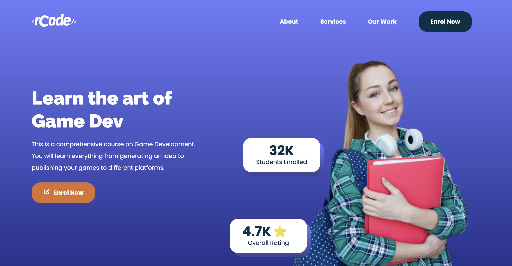

# rcodeTest

**rcodeTest** is a practice project to develop and design a responsive webpage using **HTML**, **CSS**, and **JavaScript**. This project focuses on front-end implementation, following modern design principles.



🌐 **[Live Website](https://rcodetest.netlify.app)**  
🎨 **[Figma Design File](https://www.figma.com/file/TRhKU3eHkohfSvS3lzBrT5/Responsive-Website---Figma-%2F-HTML---CSS---JavaScript?node-id=10%3A415&t=rDTXw576mCo5t62P-1)**

## Features

- **Responsive Design:** Fully responsive for desktop, tablet, and mobile devices.
- **Clean Layout:** Simple and intuitive design with a focus on user experience.
- **Static Content:** Developed using only front-end technologies.

## Technologies Used

- **HTML5:** Provides the structure and content of the webpage.
- **CSS3:** Styles the webpage with responsive layouts and designs.
- **JavaScript:** Adds basic interactivity and functionality.

## Installation

To view this project locally:

1. Clone the repository:
   ```bash
   git clone https://github.com/rodrigovaladao/rcodeTest.git
   ```
